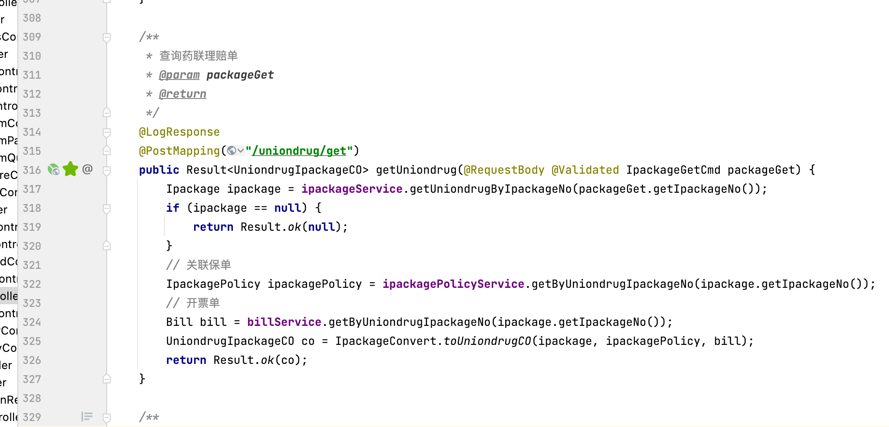
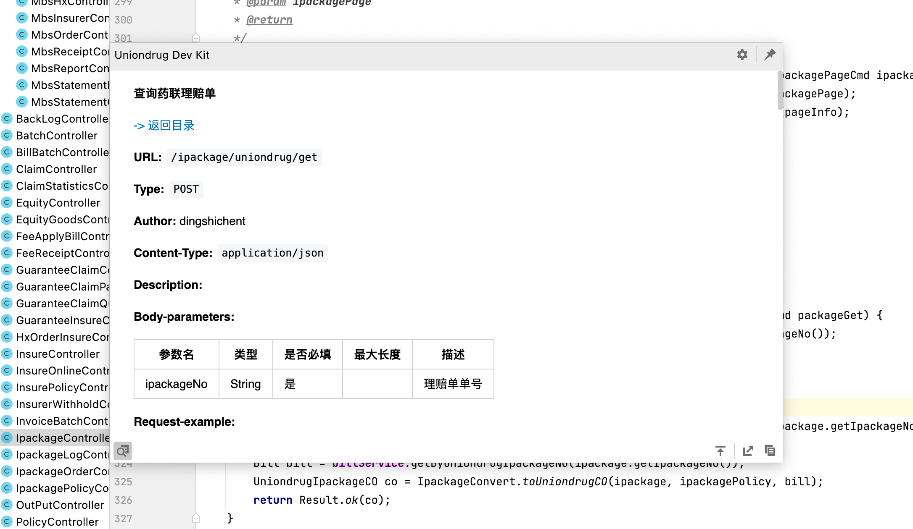
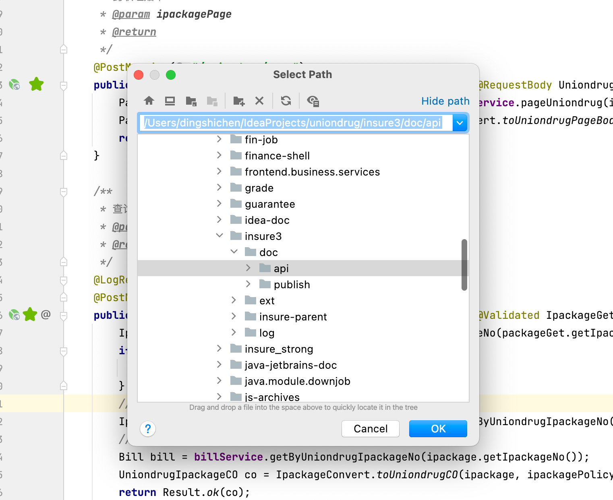

与 V1 有什么不同？支持预览、上传文档中心、响应更快......

### 下载
目前插件尚未通过 Jetbrains 审核，可加入钉钉群 “IntelliJ 插件兴趣群” 下载离线安装包

### 特性
- 一次安装、到处运行。
- 无侵入式支持

### 使用环境
- IntelliJ IDEA — 2018.1 — 2022.1.*
- 遵循 药联 Java 开发规范 的项目

### 使用方法
> 1 符合药联开发约定的接口方法左边会显示 绿色⭐️

> 2 点击 绿色⭐️ 展示文档预览

> 3 点击右下角导出按钮会弹出路径选择器，可导出到指定路径
