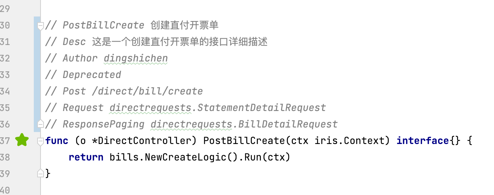
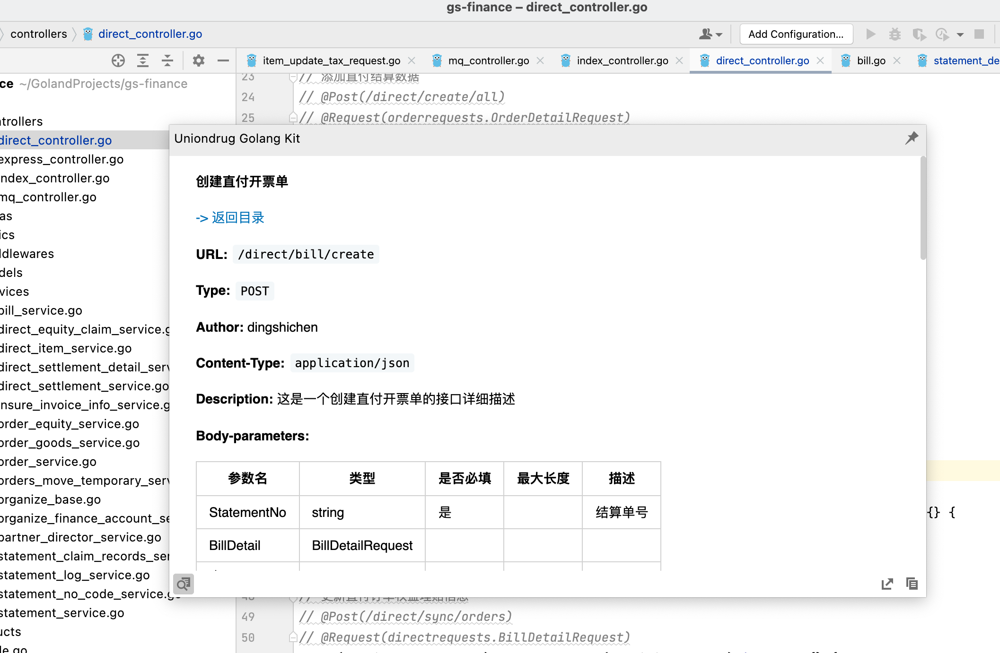
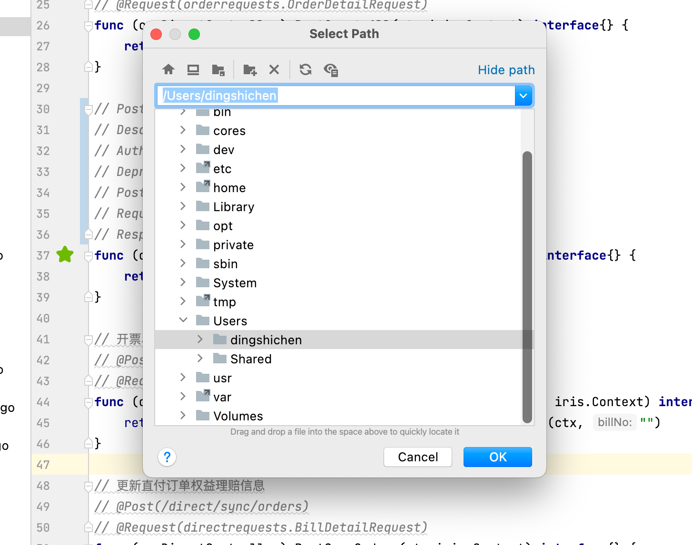

### 下载
目前插件尚未通过 Jetbrains 审核，可加入钉钉群 “IntelliJ 插件兴趣群” 下载离线安装包

### 特性
- 一次安装、到处运行。
- 无侵入式支持

### 使用环境
- Goland — 2018.1 — 2022.1.*

### 接口注释规范
1. 【强制】`方法上首行注释为 {方法名} {接口名称}`
2. 【可选】// Desc {接口描述}
3. 【可选】// Author {作者}
4. 【可选】// Deprecated {过期描述}
5. 【建议】// {HttpMethod} {路径} （遵循 iris 框架风格，没有此行注释时，默认转换方法名，如 PostBillCreate 转换成 Post 请求路径为 /bill/create）
6. 【强制】// `Request {包}.{入参结构体}`
7. 【可选】// Response 无后缀时，代表返回一个无 data 的 Result。此时也可不加此行注释，缺省返回 无 data 的 Result
8. 【可选】// ResponseData {包}.{返回数据结构体} 代表返回一个此 data 的 Result
9. 【可选】// ResponseList {包}.{返回数据结构体} 代表返回一个此 data数组 的 Result
10. 【可选】// ResponsePagingBody {包}.{返回数据结构体} 代表返回一个此 data分页结构 的 Result

example:
```kotlin
// PostBillCreate 创建直付开票单
// Desc 这是一个创建直付开票单的接口
// Author dingshichen
// Deprecated 计划2028年将此接口弃用
// Post /direct/bill/create
// Request directrequests.StatementDetailRequest
// ResponsePaging directrequests.BillDetailRequest
func (o *DirectController) PostBillCreate(ctx iris.Context) interface{} {
    return bills.NewCreateLogic().Run(ctx)
}
```

### 使用方法
> 1 注释符合规范的API接口方法前面会显示 绿色 ⭐️


> 2 点击 绿色 ⭐️ 即预览文档


> 3 点击右下角导出按钮可选择地址导出

